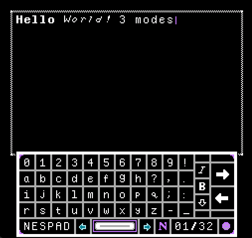
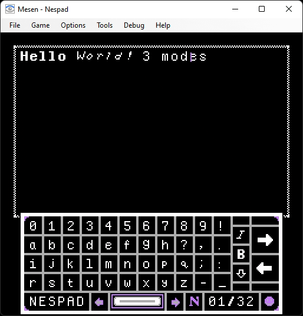
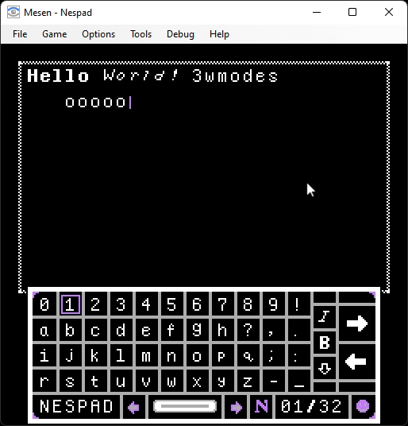
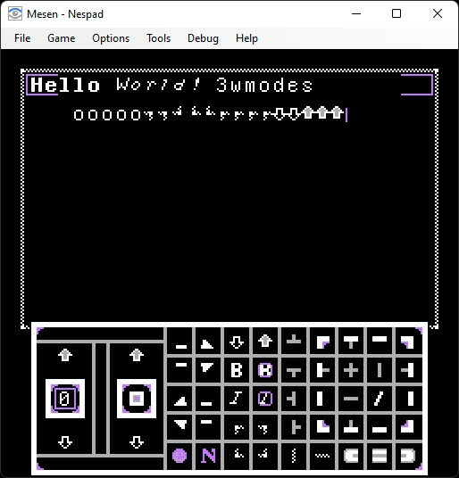
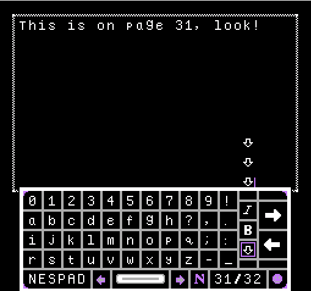

# Nespad
Nespad is a text editor developed for the Nintendo Entertainment System (1983), written in 6502 Assembly.

## Feature List
Supported features:
- An on-screen keyboard, with a separate symbol keyboard accessible
- Writing in normal, **bold**, and *italic* text; all of them either capital or lowercase
- 32 pages of text
- Caret movement with character insertion
- Changing color per line of text, choosing between 4 options
- Saving text on-cartridge between sessions
- Audio clips when buttons are pressed

<h2>Gallery</h2>

### Running on Real Hardware

### Text modes

### Insertion Mode (GIF)

### Symbol Keyboard (GIF)

### Color Changing (GIF)

### Pages

## Tools & Environment Setup
There are several tools in use developed specifically for this project.

### Build Process
The project is built through scripts calling cc65 in `scripts/`. This includes tests, linting, assembling, and linking. All variables in the build process should be controlled through the `.env` file in the project root.

### Nestest
This is a unit testing framework developed for NES development. More information can be found on the [Nestest's Repository](https://github.com/Akadeax/nestest). 
 
This project uses a total of 96 tests spread across 24 test cases and has extensive test coverage.
There are also VSCode tasks and git hooks setup for this project to run tests before commits. To setup hooks, use `git config core.hooksPath .hooks`.

### 6502-linter
A simple linter that confirms usage of function inputs/outputs to be compliant with function names. More details can be found on it's [Repository Page](https://github.com/Akadeax/6502-linter).

## Credit
Huge thanks to Viktor Mendonck for contributing roughly half the commits in this project.
 
Additionally, thanks to Tom Tesch for providing both real NES hardware to test this on and assistance in understanding the console.

 # License
 This is public domain, [Unlicense](https://unlicense.org/) specifically. Whether you wish to use it, contribute, fork, or redestribute; feel free to do so.